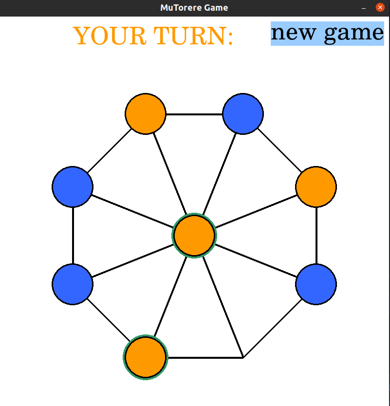
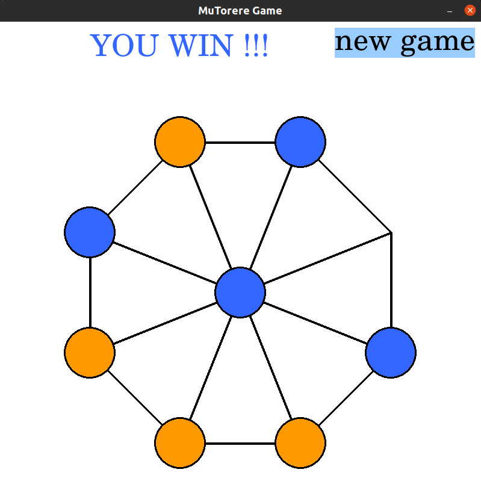

# Mu Torere Game

The aim of this project is to develop the Python code to play the [Mū tōrere Game](https://en.wikipedia.org/wiki/M%C5%AB_t%C5%8Drere).
It uses the [Pygame](https://www.pygame.org/docs/) module, and allows the players to customize the game.
The figure below shows a screenshot of an ongoing game.

Run the [```/src/main.py```](/src/main.py) and give it a try! :)



## Game Rules
Mū tōrere is a two-player board game played mainly by Māori people from 
New Zealand's North Island. Each player has four counters. Like many other
Māori board games, it is tightly interwoven with stories and histories.

The board is in the form of an eight-pointed star with endpoints, called *kewai*,
connected to the center point, or *pūtahi*. The lines connecting the *kewai* to the
*pūtahi* are oriented at 45 degrees.

Each player controls four *counters* which are initially placed on the board 
at the *kewai* (eight-pointed star). At the beginning of the game the *pūtahi* 
(center) is empty. Players *move* one of their counters per turn to an 
empty point. Players can move only to an adjacent *kewai*, and can move to the
*pūtahi* only when the moved counter is adjacent to an opponent's counter.
The player who blocks all the opponent's counters from moving is the winner.

## Code
The code has been organized following the *Object-Oriented Programming (OOP)* paradigm.
The logic of the game is split into *three classes* that can be found in the 
[```/src```](/src) directory. Each class implements a different concept and
might use or depend on other classes. Each module has its ```__main__``` function 
with a short *demo* on how the module works. Feel free to run each file as
many times as you need to fully understand how it is used.

The following figure shows the hierarchy and dependencies
between classes. In the next paragraphs, each module will be explained in more detail.


* [**MuTorereSpace:**](/src/mu_torere_space.py): implements the logic behind a 
space in a Mu Torere board. There are 9 spaces in a simple board. Each player
has 4 counters that are placed in different spaces, so at any step there is 
only one empty space.

* [**MuTorereBoard**](/src/mu_torere_board.py): implements the logic behind a 
Mu Torere Board. Allows and manages the movement of counters along the board.
Displays the board (an eight-pointed star) and its counters (MuTorereSpace).

* [**GameHandler**](/src/game_handler.py): implements the logic of a Mu Torere
Game. Process each turn and updates the state of the game. It updates the GUI
(screen) according to the game state. Calling the 'run' method will run the game.

* [**main.py**](/src/game_handler.py): initialize a ```GameHandler``` instance 
and run the game.

* [**config:**](/config/config.json): *json* file that allows the players to 
customize their game without having to change anything in the code.


## Running The Game
In the [```/src```](/src) directory there is a file named [```main.py```](/src/main.py).
Run this file in order to play the game. Basically, it initializes a ```GameHandler``` instance
and calls its ```run``` method. Use your mouse to right-click on the counters
you want to move. Alternate turns with your opponent and have some fun!

Here is an example of a game won by the blue Player:



